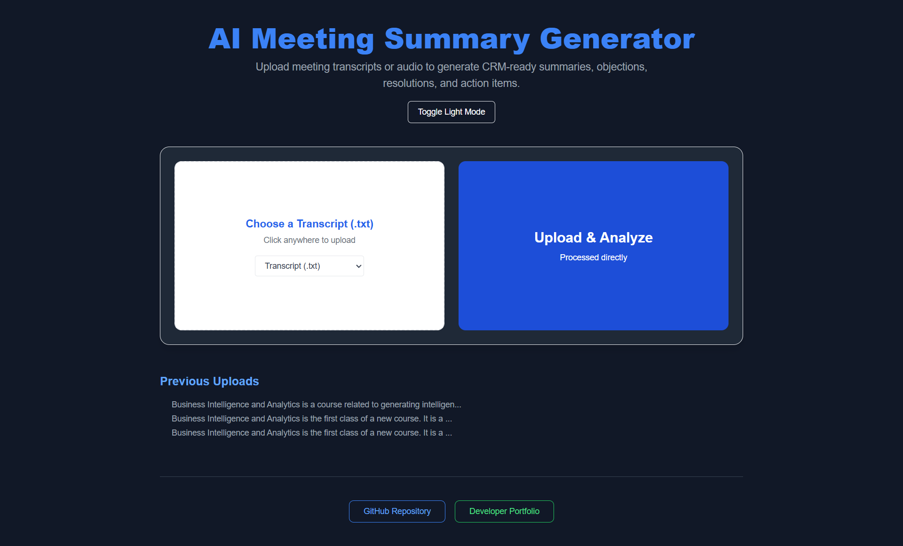
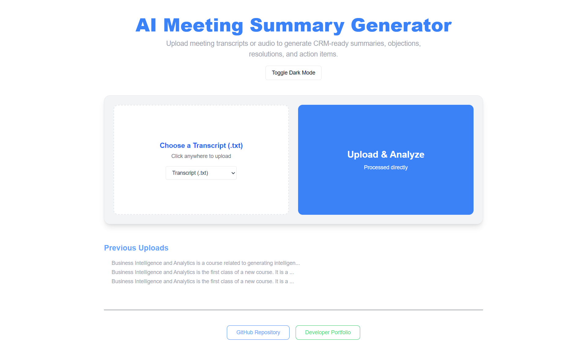

---

## AI Meeting Summary Generator

A React-based web app to generate CRM-ready meeting summaries, objections, resolutions, and action items from uploaded **transcripts** or **audio files** using AI. Supports both light and dark themes and provides options to export summaries in JSON and CSV formats.

---

### Features

* Upload `.txt` transcripts or `.mp3/.wav/.m4a` audio files
* Audio is automatically transcribed using Whisper API
* AI summarizes the input and returns:

  * Summary
  * Objections
  * Resolutions
  * Action Items
* Export output as JSON or CSV
* Toggle between **Dark** and **Light** mode
* View previously generated summaries (persisted in local storage)

---

### Preview





---

### Tech Stack

* **Frontend**: React (Vite)
* **Styling**: Tailwind CSS
* **Icons**: React Icons
* **API Calls**: Axios
* **State Management**: useState, useEffect (React Hooks)

---

### Installation & Running Locally

> Ensure the backend server is running at `http://localhost:5000`.

```bash
# Clone the repo
git clone https://github.com/AdwitiyaKhare/ai-meeting-summary.git

# Go to frontend directory (if applicable)
cd ai-meeting-summary

# Install dependencies
npm install

# Start development server
npm run dev
```

---

### Usage

1. Choose a `.txt` transcript or audio file (`.mp3`, `.wav`)
2. Click **Upload & Analyze**
3. Wait for the summary to be generated
4. Toggle between light and dark mode
5. Download results using **Export JSON** or **Export CSV**

---

### Output Example

```json
{
  "summary": "Business Intelligence and Analytics is the first class...",
  "objections": ["N/A (free model limitation)"],
  "resolutions": ["N/A (free model limitation)"],
  "action_items": ["N/A (free model limitation)"]
}
```

---

### Links

* [Backend Repo (API)](https://github.com/AdwitiyaKhare/ai-meeting-summary)
* [Developer Portfolio](https://adwitiyakhare.vercel.app/)

---

### Author

Made by [Adwitiya Khare](https://adwitiyakhare.vercel.app/)

---
